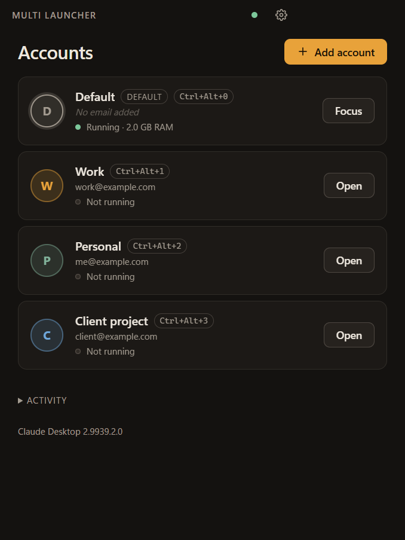
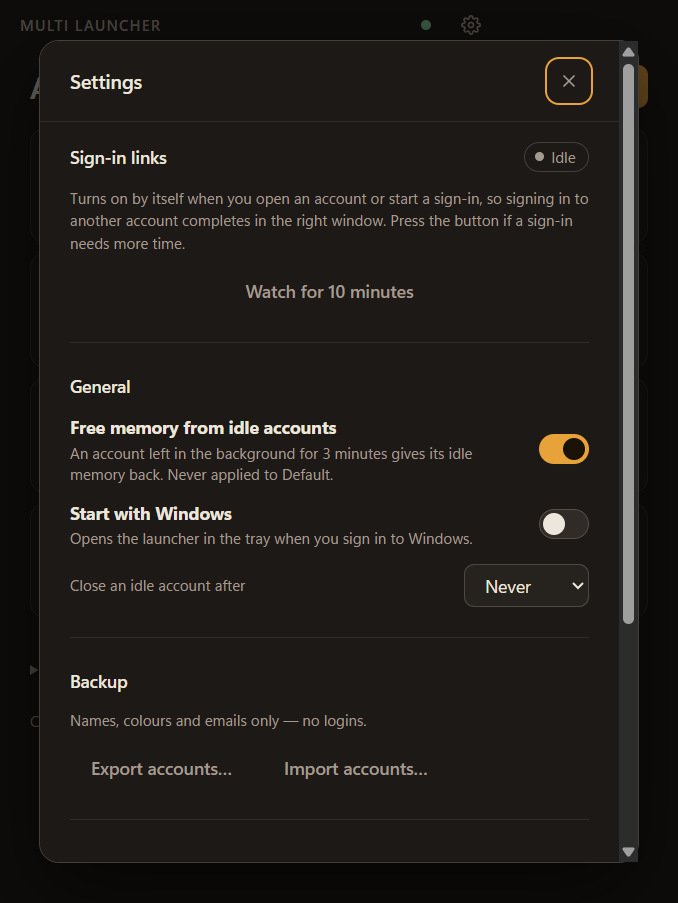

# Multi Launcher for Claude Desktop

**Run several Claude Desktop accounts side by side on Windows.** Each account gets its own isolated Claude window with
its own login, so personal, work and client accounts stay signed in together instead of taking turns.

[](https://github.com/SumantSagar73/multi-launcher-for-claude-desktop/actions/workflows/ci.yml)
[](https://github.com/SumantSagar73/multi-launcher-for-claude-desktop/releases/latest)
[](LICENSE)


<p align="center">
  
  &nbsp;
  
</p>

## Why

Claude Desktop for Windows signs in to one account at a time. Switching means signing out, signing in, and losing your
place. This launcher starts each account in its own copy of Claude with a separate data folder, and takes care of the
awkward parts: getting a browser sign-in back to the right window, telling the windows apart, and keeping memory in
check.

## Features

- **Separate accounts, side by side.** Logins, chats and settings never mix. Your normal Claude stays as the *Default*
  account and is never modified.
- **Sign-in that lands in the right window.** Signing in to a second account in the browser hands the result to the
  window that asked for it, not to your default Claude.
- **Windows you can tell apart.** Every extra account gets its own taskbar button, a coloured icon with its initial and
  a `[Name]` title prefix.
- **Fast switching.** `Ctrl+Alt+0` to `Ctrl+Alt+9` open or focus an account from anywhere. Make a Start Menu shortcut
  for any account. Tile several account windows on screen with one click.
- **Easy on memory.** Accounts left in the background give their idle memory back (about 1.6 GB down to about 0.2 GB
  in testing). Optionally close an account after it has been idle for a set number of hours.
- **Know what each account costs.** Per-account RAM and disk use, including the large Cowork VM image.
- **Set up new accounts faster.** Copy another account's MCP server settings into a new one when you add it.
- **Backup and diagnostics.** Export and import your account list (names, colours and emails only, no logins), a health
  check, and a one-click "copy diagnostics" for bug reports.

## Requirements

- Windows 10 or 11, 64-bit.
- **Claude Desktop installed from the Microsoft Store** (the app named "Claude"). The launcher finds it automatically
  and follows its updates.

## Install

1. Download the latest files from the [**Releases**](https://github.com/SumantSagar73/multi-launcher-for-claude-desktop/releases/latest) page.
2. Pick one:
   - `Multi-Launcher-for-Claude-Desktop-<version>.exe` is a one-click installer. It installs for your user only and needs no admin
     rights.
   - `Multi-Launcher-for-Claude-Desktop-<version>.zip` is a portable copy. Unzip it anywhere and run `Multi Launcher for Claude Desktop.exe`.
3. Run it. The launcher lives in the system tray; closing its window just hides it.

**Windows SmartScreen.** The downloads are not code-signed (that needs a paid certificate), so Windows may show
"Windows protected your PC". Choose **More info**, then **Run anyway**. Each release lists a SHA-256 checksum
(`SHA256SUMS.txt`) so you can check you have the exact file that was published:

```powershell
Get-FileHash .\Multi-Launcher-for-Claude-Desktop-<version>.exe -Algorithm SHA256
```

Uninstall from **Settings > Apps**. Your accounts are kept (in `%APPDATA%\Claude Multi Launcher`) so a reinstall picks
them up again, and your normal Claude data is never touched.

## Quick start

1. Click **Add account**, give it a name and a colour. The email is an optional label to help you remember which
   account is which.
2. Click **Open**. A fresh Claude window appears with its own, empty login.
3. Sign in inside that window (Google, email or SSO). In the browser, sign in as the account you want. A browser
   profile that is already signed in as that account, or a private window, works well.
4. When the browser finishes, your Default Claude may flash for a moment and ignore the link. The launcher passes it to
   the new window, which finishes signing in. **Settings > Sign-in links** and the *Activity* list show what happened.

## How sign-in routing works

Windows sends every `claude://` link to one app, and Claude's Store package always wins that. So when you finish a
browser sign-in for a second account, Windows starts Claude with the link, and it goes to your Default Claude, which
correctly refuses a sign-in it never started. The launcher watches for that short-lived process, reads the link off its
command line, and forwards it to the account that began the sign-in (found from that account's own log). No Windows
settings are changed. Details are in [docs/ARCHITECTURE.md](docs/ARCHITECTURE.md).

## Privacy and safety

- **Your Default Claude is never modified, closed, restyled or trimmed.** The launcher only reads which Claude
  processes are running and a line from its log.
- **No secrets.** It never reads or decrypts sign-in tokens or cookies. The email shown is a label you typed.
- **No network requests of its own and no telemetry.**
- **What it reads:** the process list and their command lines, Claude's own log files (to see which account opened a
  sign-in page), and, only when you ask, one settings file to copy MCP servers into a new account.
- **What it changes:** its own data under `%APPDATA%\Claude Multi Launcher`, the icon, title and taskbar identity of
  the windows it opened, and, only when you switch them on, a Start Menu shortcut or a "start with Windows" entry.

The code is small and readable. See [SECURITY.md](SECURITY.md) to report a problem.

## Limitations

- Windows only, and the Microsoft Store version of Claude Desktop only.
- Each account that uses Cowork downloads its own VM image (about 8 GB). Sharing one between accounts is not
  attempted because two running VMs cannot safely share one writable disk.
- Freed memory is moved out of RAM, not capped. The first click after a long idle can be a little slower.
- Sign-in routing depends on how Claude Desktop behaves today. If a Claude update changes it, the health check and
  Activity list will show it. Please open an issue.
- `Ctrl+Alt+<n>` hotkeys are global; if another program already uses one, that slot will not fire.

## Troubleshooting

| Problem | What to try |
| --- | --- |
| A sign-in did not complete | Open **Settings > Sign-in links** and press *Watch for 10 minutes*, then sign in again. Check *Activity* for where the link went. |
| Windows asks "How do you want to open this?" for Claude links | **Settings > Health check** may show a leftover registration with a **Fix** button. |
| The launcher says Claude is not found | Install Claude Desktop from the Microsoft Store, then reopen the launcher. |
| Something else | **Settings > Copy diagnostics**, then paste the result into a new issue. |

## Build from source

Needs Node.js 24 or newer.

```powershell
git clone https://github.com/SumantSagar73/multi-launcher-for-claude-desktop.git
cd multi-launcher-for-claude-desktop
npm install
npm start          # run from source
npm test           # unit tests
npm run release    # build the installer and portable zip into release/
```

See [CONTRIBUTING.md](CONTRIBUTING.md) for how to work on it safely, and [CHANGELOG.md](CHANGELOG.md) for what changed.

## Disclaimer

This is an unofficial community project. It is not affiliated with, endorsed by or sponsored by Anthropic. "Claude" is
a trademark of Anthropic. Use it with your own accounts and in line with Anthropic's terms of service. It does not try
to bypass usage limits.

## License

[MIT](LICENSE)
