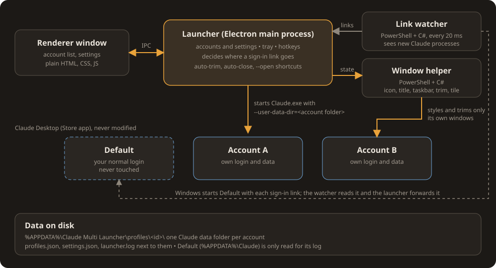
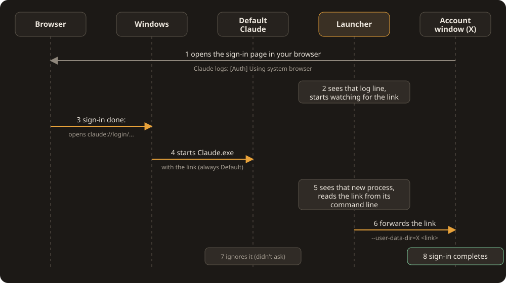

# Architecture

Multi Launcher for Claude Desktop is an Electron app (main process, one renderer window) plus two small PowerShell helpers. It does
not modify Claude Desktop; it starts it with different `--user-data-dir` folders and watches from the outside.



The same diagram as text, for viewers that do not show images:

```text
+------------------+   IPC    +------------------------------------+
| Renderer window  |<-------->| Launcher (Electron main process)   |
| account list,    |          | accounts, tray, hotkeys, decides   |
| settings         |          | where a sign-in link goes          |
+------------------+          +------------------------------------+
                                  |          ^              |
                    state, styling|          | links        | starts Claude.exe with
                                  v          |              | --user-data-dir=<account folder>
                 +---------------------+  +-----------------+              |
                 | Window helper       |  | Link watcher    |              v
                 | PowerShell + C#     |  | PowerShell + C# |   +---------+  +-----------+  +-----------+
                 | icon, title,        |  | sees new Claude |   | Default |  | Account A |  | Account B |
                 | taskbar, trim, tile |  | processes every |   | your    |  | own login |  | own login |
                 +---------------------+  | 20 ms           |   | login,  |  | and data  |  | and data  |
                                          +-----------------+   | never   |  +-----------+  +-----------+
                                                                | touched |
                                                                +---------+
                                       Claude Desktop (Microsoft Store app), never modified

Data on disk: %APPDATA%\Claude Multi Launcher\profiles\<id>\  (one Claude data folder per account),
              plus profiles.json, settings.json and launcher.log next to them.
```

## Sign-in routing



The same diagram as text:

```text
   Browser         Windows         Default Claude         Launcher         Account window X
      |               |                   |                   |                     |
      |<------------------------- 1 opens the sign-in page -------------------------|
      |               |                   | 2 sees that log line, starts watching   |
      |               |                   |                   |                     |
      | 3 sign-in done: opens claude://login/...              |                     |
      |-------------->|                   |                   |                     |
      |               |                   |                   |                     |
      |               | 4 starts Default Claude with the link |                     |
      |               |------------------>|                   |                     |
      |               |                   |                   |                     |
      |               |                   | 5 sees that new process, reads the link |
      |               |                   |                   | 6 forwards the link |
      |               |                   |                   |-------------------->|
      |               |                   |                   |                     |
      |               |               7 ignores it            |    8 sign-in completes
```

1. The account window opens the sign-in page in your browser and logs `[Auth] Using system browser`.
2. The launcher sees that line and starts watching for the link.
3. When the browser finishes, Windows opens the `claude://login/...` link.
4. Windows always starts the Default Claude with it, as a short-lived process.
5. The launcher sees that process and reads the link from its command line.
6. It forwards the link with `Claude.exe --user-data-dir=X <link>` to the account that asked.
7. The Default Claude ignores the link, because it never started that sign-in.
8. The account window recognises its own sign-in and completes it.

Why not just register as the `claude://` handler? Claude Desktop is a Microsoft Store (MSIX) app. Windows resolves its
protocol through the package registration and ignores a plain `HKCU\Software\Classes\claude` override, and an
unpackaged app is not offered in Settings > Default apps for that link type. Both were tried; see *Dead ends* below.

## Modules (`src/`)

| File | Responsibility |
| --- | --- |
| `main.js` | App start-up, tray and window, IPC actions, timers (auto-trim, auto-close, sign-in start detection), hotkeys, `--open` handling |
| `claude.js` | Find the installed Claude (`Get-AppxPackage`), list running instances, match them to accounts, launch and quit |
| `profiles.js` | Account store (`profiles.json`, `settings.json`), name rules, import/export merge |
| `router.js` | Pure decisions: is a link a sign-in callback, which account gets it, what an `--open` value means |
| `linkwatch.js` / `linkwatch.ps1` | Watches for new Claude processes carrying a `claude://` link (C# `EnumProcesses` every 20 ms; reads the command line from the process's PEB) |
| `winhelper.js` / `winhelper.ps1` | Per-account window identity (AppUserModelID, icon, title prefix), working-set trim, tiling |
| `layout.js` | Pure grid maths for tiling |
| `handlercheck.js` | Detects and removes a leftover registration that makes Windows prompt for Claude links |
| `shortcut.js`, `icon.js`, `ico.js` | Start Menu shortcuts and the icons they use |
| `disk.js` | Folder size for the disk column |
| `renderer/` | The UI (plain HTML, CSS and JS, no framework) |

The PowerShell helpers are copied out of the app bundle at run time because PowerShell cannot read `app.asar`. They
exit on their own when the launcher does.

## Data

- Accounts: `%APPDATA%\Claude Multi Launcher\profiles\<id>\` (one Claude data folder each), plus `profiles.json`,
  `settings.json` and `launcher.log` next to them.
- Default: `%APPDATA%\Claude`. Read for its log, and for `claude_desktop_config.json` only if the user picks it as the
  source when adding an account. Never written, closed, styled or trimmed.
- The launcher never reads Claude's token caches, cookies or device identifiers.

## Safety rules in the code

- Quit, trim, style and tile refuse or skip the Default account.
- Deleting an account's data only happens inside the launcher's own `profiles\` folder.
- Windows registry writes are limited to what the user turns on (start with Windows) and the removal of one specific
  leftover registration.

## Dead ends (do not retry)

- Overwriting `HKCU\Software\Classes\claude`: ignored for Store apps.
- Registering under `RegisteredApplications` / `Capabilities` / `OpenWithProgids` so the launcher appears in Default
  apps: it never appeared, and it made Windows show an "Open with" prompt for every Claude link.
- WMI process-start events: need administrator rights.
- Sharing one Cowork VM image between accounts: two VMs cannot share one writable disk.

## Gotchas learned the hard way

- A profile path containing a space makes Node quote the whole `--user-data-dir=...` argument. `parseUserDataDir`
  handles all three quoting styles.
- `SetWindowPos` with `SWP_NOZORDER` ignores the insert-after argument, so tiled windows stayed hidden behind others.
- The link-watcher's 20 ms check matters: the process Windows starts for a link can be gone within a few hundred
  milliseconds.
- Claude's install path changes on every update, so it is looked up each time rather than remembered.

## Test hooks (environment variables)

| Variable | Effect |
| --- | --- |
| `CML_USER_DATA` | Use another data folder, so tests never touch real accounts |
| `CML_BACKGROUND_MS` | Shorten the 3-minute idle timer |
| `CML_ZOOM` | With `--screenshot`, zoom the window contents |
| `CML_CLICK` | With `--screenshot`, click a CSS selector before capturing |

`electron . --screenshot=out.png` renders the launcher's own window to a PNG and quits. It never captures the desktop.

## Verified on

Windows 11 (build 26200) with Claude Desktop 2.9939.x from the Microsoft Store.
